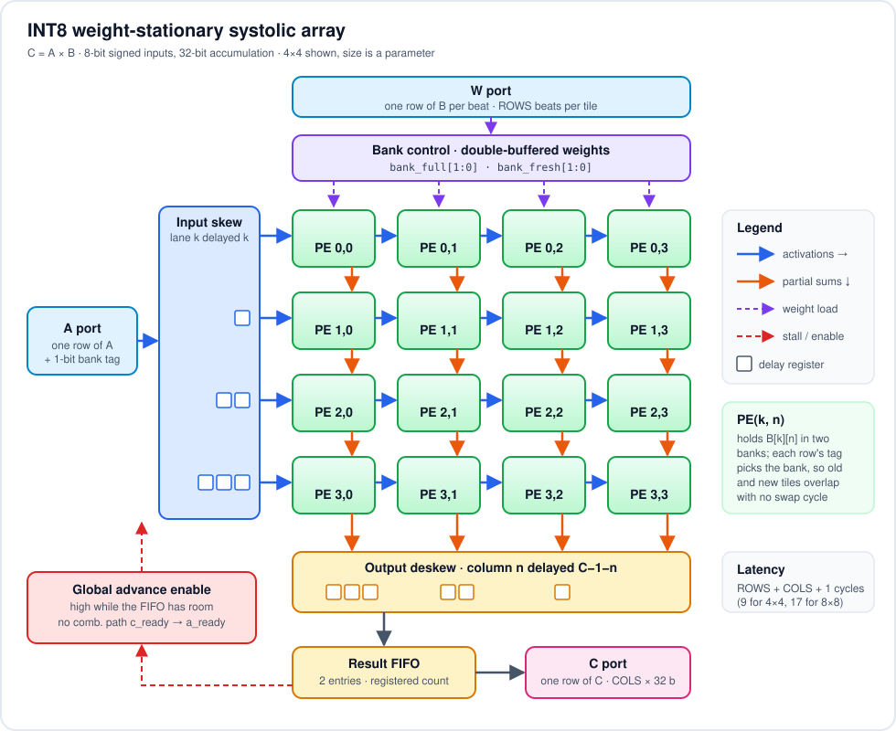
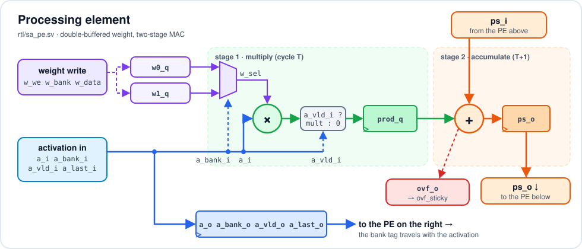

# INT8 Systolic Array

This is a weight-stationary systolic array for INT8 matrix multiplication,
written in SystemVerilog. It computes `C = A x B` with 8-bit signed inputs and
32-bit accumulation, and the array size is a parameter (I mostly worked with
4x4 and 8x8).

I wanted to take one block all the way through: RTL, a self-checking
testbench, formal proofs, FPGA place-and-route in Vivado, and an ASIC flow in
OpenLane on the SkyWater 130 nm PDK. This README is a record of how that went,
including the bugs and the timing work.

## Summary

- Weight-stationary dataflow with double-buffered weights, so the array keeps
  running from one tile to the next without a stall
- Two-stage multiply-accumulate in every processing element
- Valid/ready (AXI4-Stream style) handshakes on all three ports, with
  backpressure that never creates a combinational path from output to input
- 19-run regression over six array shapes, 41,640 result rows checked against
  a golden model, on both Verilator and the Vivado simulator
- Formal proof (SymbiYosys, k-induction) that a weight buffer is never
  overwritten while it is still in use
- Artix-7: 176 MHz for 4x4, 159 MHz for 8x8
- SKY130: DRC- and LVS-clean layout, setup met at all nine PVT corners at 77 MHz

## How it works

<p align="center">
  
</p>

PE(k, n) holds weight `B[k][n]`. Each row of A is fed in with element k on
lane k, delayed by k cycles, so that it lines up with the partial sum for the
same row as both move through the array. At the bottom of column n you get
`C[m][n]`. The deskew stage realigns the columns so a full result row comes
out in one beat.

**Processing element** (`rtl/sa_pe.sv`). Two weight registers (bank 0 and
bank 1) and a two-stage MAC: the product is registered first, and the add
happens the next cycle. The partial sum from the PE above arrives exactly when
the registered product is ready, so the vertical chain still moves one row per
cycle and the skew logic didn't have to change.

<p align="center">
  
</p>

**Double buffering.** While one tile is streaming, the next tile's weights
load into the other bank. I didn't want a global "swap" cycle, so every
activation carries a 1-bit bank tag, and each PE uses whichever bank the
arriving row asks for. Rows from the old tile and the new tile can be in the
array at the same time.

**When a bank can be reloaded.** Only after the last row of its tile has been
multiplied by the bottom-right PE, because that PE is the last one to see any
row. This needs two flags per bank, and getting it wrong was the most
interesting bug in the project (see below): `bank_full` means loaded and not
yet retired, which blocks new weight writes; `bank_fresh` means its tile has
not been fully accepted yet, which is what allows activation rows in.

**Backpressure.** The whole array advances on one enable that is high when
the output FIFO has room. The FIFO count is a register, so there is no
combinational path from `c_ready` to `a_ready`. Two FIFO entries are enough
for full throughput.

**Overflow.** The worst case is `ROWS * 128 * 128`, and that has to fit in
the signed accumulator. If `ACC_W` is too small, elaboration stops (I
instantiate a module that doesn't exist, which every tool treats as an
error). There is also a sticky `ovf_sticky` flag, and one regression build
deliberately shrinks the accumulator to make sure the flag fires.

### Ports

| port | one beat is | notes |
|---|---|---|
| `w_*` | one row of B (`COLS` bytes), plus `w_row` | `w_last` on the final row; `ROWS` beats per tile |
| `a_*` | one row of A (`ROWS` bytes) | `a_last` on the tile's last row; any number of rows per tile |
| `c_*` | one row of C (`COLS` x 32 bits) | `c_last` on the row produced by `a_last` |

Parameters: `ROWS`, `COLS`, `DW` (8), `ACC_W` (32).

### Latency and throughput

A row takes ROWS + COLS + 1 cycles from being accepted to its result being
handed over: 3 cycles for 1x1, 9 for 4x4 and 3x5, 17 for 8x8.

For throughput I streamed back-to-back tiles into a 4x4 array with no gaps
and no backpressure, and measured how often a new row went in:

| rows per tile | 1 | 4 | 8 | 12 | 16 |
|---|---|---|---|---|---|
| array busy | 19.2 % | 59.7 % | 89.9 % | 100 % | 100 % |

Short tiles leave gaps because a bank can't be reloaded until its tile has
drained out (about ROWS + COLS cycles), and loading takes another ROWS
cycles. With two banks that is only hidden once a tile has at least
2·ROWS + COLS rows. A third bank, or retiring each PE row separately, would
fix it. I left it as it is and measured it instead.

## Verification

### Simulation

The testbench (`tb/tb_sa_core.sv`) checks itself against a plain integer
matrix multiply. It runs on Verilator and on Vivado's xsim. xsim is useful
here because it is 4-state, so X propagation problems would show up.

It covers directed cases (identity and all-ones weights), corner values
(-128 x -128, 127 x -128, -128 x 127, one-row tiles), and then 240 random
tiles per run with random tile lengths, random gaps on both inputs, and
random backpressure on the output (always ready, 60 % ready, 20 % ready).
Every result row is compared in order, including `c_last`. A handful of
coverage counters check that the important situations actually happened:
backpressure, weights loading while the array computes, both banks full, and
the array stalling. If any of them never happened, the run fails.

The regression (`make regress`) runs six array shapes (1x1, 2x2, 4x4, 3x5,
5x3, 8x8) with three seeds each, plus the overflow build:

```
REGRESSION PASSED (19 runs)      41,640 result rows checked, 0 errors
```

### Assertions

`tb/sa_props.sv` is bound into the design for simulation and used directly
for formal:

| | property |
|---|---|
| P1 | a weight bank is never written while a row that will use it is still in the array |
| P2 | the C port follows AXI4-Stream rules: with valid high and ready low, valid stays high and the data doesn't change |
| P3 | the result FIFO never overflows or underflows |
| P4 | a row is only accepted when its bank holds the weights for its own tile |
| P5 | no accumulator overflow |

### Formal

I used SymbiYosys with the Yices solver on a 2x3 array, leaving every input
completely free. The solver can drive any traffic at all, including traffic
that breaks the handshake rules.

| task | result |
|---|---|
| prove | P1 to P4 proved for all time by k-induction (29 assertions) |
| bmc | P1 to P5 hold for 30 cycles from reset |
| cover | both banks loaded, loading during compute, a full tile out, backpressure reaching the input: all reachable |

Getting P1 to prove took some work. Induction can start in any state,
including impossible ones, so I had to write down why the design is safe as
extra invariants:

- every activation lane carries the same row tag at the same age (the skew
  registers and PE registers line up)
- the in-flight counter equals the number of valid rows tagged with that bank
  in the longest lane
- an empty bank has nothing in flight, and a bank that is full but no longer
  fresh still has its last row in flight, which is also its youngest row
- the FIFO pointers agree with the count

P5 can't be proved by induction this way, because the induction step could
start from any partial sums. It gets a 30-cycle bounded check, and the
elaboration-time width check covers it structurally.

To make sure the proof could actually fail, I put known bugs back into a
copy of the RTL and reran it (`make mutants`):

```
stale_weights   (a_ready only checks bank_full)        caught
early_retire    (retire on any row, not the last)      caught
no_bank_check   (weights writable at any time)         caught
fifo_3_deep     (ignore the FIFO count)                caught (induction fails)
keep_fresh      (never clear bank_fresh)               caught
```

### Bugs I hit

1. **A signed multiply that wasn't signed.** I wrote
   `a_vld ? $signed(a) * w : '0`. The unsigned `'0` makes the whole
   conditional unsigned, multiply included, so every negative activation was
   off by a multiple of 256. Moving the multiply into its own statement fixed
   it.
2. **Stale weights.** My first version had only the `bank_full` flag. When
   the read pointer wrapped back to a bank that was still draining the
   previous tile, new rows were accepted against the old weights. Assertion
   P1 caught it in the first random run, and the fix was the second flag,
   `bank_fresh`.
3. **A testbench variable that only initialised once.** Writing
   `w_beat_t b = wq.pop_front();` inside an `always` block declares a static
   variable. The initialiser runs once at time zero, so the driver kept
   resending the first beat.
4. **Timing**, covered in the next section.

## Implementation

### FPGA (Vivado 2021.1, Artix-7 xc7a100tcsg324-1, out-of-context place and route)

| configuration | Fmax | LUT | FF | DSP48E1 | dynamic power* |
|---|---|---|---|---|---|
| 4x4, DSP multipliers | 176 MHz | 314 | 816 | 32 | 146 mW |
| 4x4, LUT multipliers | 150 MHz | 1,894 | 1,227 | 0 | 62 mW |
| 8x8, DSP multipliers | 159 MHz | 946 | 2,622 | 128 | 517 mW |
| 8x8, LUT multipliers | 146 MHz | 7,571 | 4,623 | 0 | 230 mW |

\* Vivado's vectorless estimate at a 250 MHz constraint.

8x8 is nearly as fast as 4x4 because the critical path stays inside one PE,
which is the whole point of a systolic array.

Getting to 176 MHz on the 4x4:

| step | critical path | Fmax |
|---|---|---|
| first version | skew register, multiply, add, overflow test, then an OR of all 16 overflow flags into `ovf_sticky` | 92 MHz |
| register each PE's overflow flag before the OR | multiply and add in the same cycle | 100 MHz |
| two-stage MAC, multipliers in DSP48s | bank-select mux into the DSP input | 176 MHz |

I also tried zeroing the activation before the multiplier instead of the
product after it, hoping Vivado would fit the multiply and add into one DSP.
It came out slower (156 MHz) and still used two DSPs per PE, so I reverted it.

### ASIC (OpenLane 2.3.10, SKY130A, sky130_fd_sc_hd, 4x4)

This is the full RTL-to-GDSII flow: synthesis, floorplan, placement, clock
tree, routing, static timing at nine PVT corners, DRC and LVS.

| clock period | 10 ns | 13 ns |
|---|---|---|
| setup slack, typical (tt, 25 C, 1.80 V) | +4.17 ns | +7.05 ns |
| setup slack, worst (ss, 100 C, 1.60 V) | -0.82 ns | +1.01 ns, met at all 9 corners |
| hold | -27 ps at ss | -58 ps, 12 paths, ss with max RC only |
| DRC (Magic, KLayout) / LVS | clean / clean | clean / clean |
| die area | 0.284 mm² | 0.284 mm² |
| standard cells | 17,306 (1,499 flip-flops) | 17,265 |
| power* | 121 mW | 94 mW |

\* OpenSTA estimate with default switching activity.

Going by the typical-corner slack, the array would run at roughly 170 MHz on
typical silicon. Worst-case setup closes at 77 MHz. The hold violations left
over are all at the slow corner with maximum wire RC, caused by about 0.6 ns
of clock skew there; a production flow would keep iterating on hold repair.
Reports for all three runs and the 13 ns GDS are in `syn/openlane/results/`.

## Running it

Open-source flow (Linux or WSL, with the YosysHQ OSS CAD Suite on the path):

```
make lint        # Verilator -Wall on three shapes
make sim         # one testbench run (ROWS=4 COLS=4 SEED=1)
make regress     # the 19-run regression
make formal      # prove, bmc and cover
make mutants     # check that the proof catches each inserted bug
```

Vivado and OpenLane (Windows):

```
powershell -File scripts\sim_xsim.ps1
vivado -mode batch -source syn\vivado_impl.tcl -tclargs 4 4 4.0 xc7a100tcsg324-1 dsp
powershell -File scripts\openlane.ps1 -Period 13      # needs Docker
```

## Files

```
rtl/      sa_pe.sv  sa_array.sv  sa_core.sv
tb/       tb_sa_core.sv  sa_props.sv
formal/   sa_core.sby  sa_formal_top.sv  results/
syn/      vivado_impl.tcl  reports/  openlane/config.json  openlane/results/
scripts/  lint, sim, regress, formal, mutants, xsim, openlane
docs/     img/  architecture and PE diagrams (SVG)
```

## What I'd do next

- Add a third weight bank, or retire each PE row on its own, so short tiles
  stop leaving gaps.
- Get each PE down to one DSP48. That means registering the bank-select mux
  so the DSP can use its own input register.
- Support accumulating across K tiles (`C += A x B`), which needs an output
  accumulator buffer.

Vineet Chadalavada
